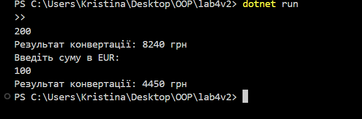

# Лабораторна робота №4 – Конвертер валют

## Завдання
Розробити програму для конвертації валют з використанням:
- інтерфейсу для визначення єдиного контракту;
- кількох класів, які реалізують цей інтерфейс;
- поліморфізму для вибору потрібного конвертера.

## Структура проєкту
- **IConverter** – інтерфейс для конвертерів валют.
- **EurToUah** – клас для перетворення EUR → UAH.
- **UsdToUah** – клас для перетворення USD → UAH.
- **CurrencyConverter** – клас-контекст, що використовує інтерфейс IConverter.
- **Program** – точка входу, де здійснюється запуск і вибір конвертера.

Інтерфейс (interface) – це контракт, який визначає набір методів без їх реалізації. Клас, що реалізує інтерфейс, зобов’язаний надати власну реалізацію цих методів.
У твоєму проєкті інтерфейс IConverter задає єдину форму для всіх конвертерів валют. Це дозволяє:

гарантувати, що всі класи-конвертери матимуть однаковий метод для виконання перетворень;

легко додавати нові валюти без зміни існуючого коду;

використовувати поліморфізм, коли об’єкт обробляється через інтерфейс, незалежно від конкретного класу.

🔹 Композиція

Композиція – це принцип, за якого клас містить у собі об’єкти інших класів і використовує їх для досягнення потрібної функціональності.
У твоєму випадку CurrencyConverter не виконує самі обчислення напряму, а компонує об’єкти класів UsdToUah, EurToUah та інші. Завдяки цьому:

можна легко замінити один конвертер іншим;

логіка програми стає гнучкішою та масштабованою;

спрощується повторне використання коду.

🔹 Агрегація

Агрегація – це "слабший" варіант композиції, коли клас має посилання на інші об’єкти, але ті можуть існувати окремо.
У програмі можна розглядати агрегування у випадку, коли CurrencyConverter працює з інтерфейсом IConverter: об’єкти конвертерів створюються самостійно, а передаються у роботу класу-контексту. Тобто вони не є невід’ємною частиною CurrencyConverter, а лише використовуються ним.

🔹 Поліморфізм

Поліморфізм дозволяє працювати з різними типами об’єктів через єдиний інтерфейс.
У твоєму проєкті метод, що виконує конвертацію, може приймати будь-який клас, який реалізує IConverter – незалежно від того, чи це UsdToUah, чи EurToUah, чи інший майбутній конвертер. Це:

спрощує масштабування системи;

дозволяє підключати нові валюти без зміни основного коду;

робить код більш зрозумілим та структурованим.

Висновок

У ході виконання лабораторної роботи було створено програму для конвертації валют із використанням принципів об’єктно-орієнтованого програмування.
Були реалізовані:

інтерфейс IConverter для визначення єдиного контракту;

декілька класів-конвертерів (UsdToUah, EurToUah), що реалізують інтерфейс;

клас-контекст CurrencyConverter, який застосовує поліморфізм для роботи з різними валютами.

Програма забезпечує правильність обчислень, надає логічний і зрозумілий вивід у консоль, а також демонструє переваги повторного використання коду завдяки інтерфейсам та поліморфізму.

Таким чином, у роботі було продемонстровано практичне застосування ключових концепцій ООП: інтерфейси, композиція, агрегація та поліморфізм.

